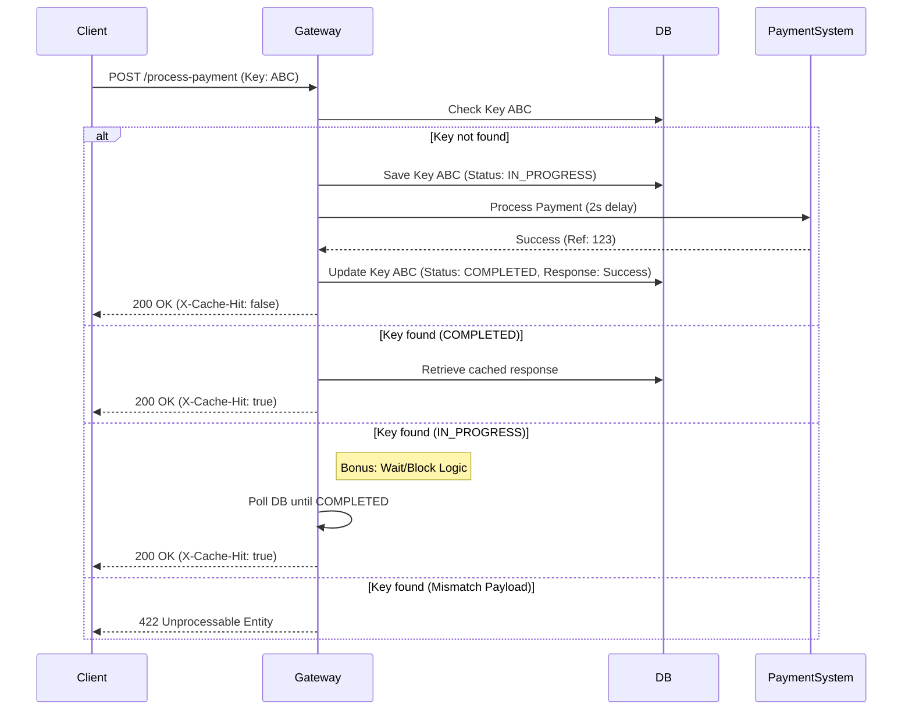

# Idempotency-Gateway (The "Pay-Once" Protocol)

Professional middleware service built for **IgirePay Technologies** to ensure payment requests are processed exactly once.

##  Overview

The **Idempotency-Gateway** acts as a safety layer for payment processing. It prevents double-charging customers by tracking unique `Idempotency-Key` headers and caching their responses. If a request is retried with the same key, the gateway returns the previous result instead of re-processing the payment.

###  Architecture Logic Flow



### Key Features
- **Deterministic Idempotency:** Uses SHA-256 hashing to verify that retried requests have the exact same payload.
- **Race Condition Protection (Bonus):** Concurrent "in-flight" requests are blocked and wait for the original process to finish, then return the same result.
- **Key Expiration (Developer's Choice):** Automatically expires and cleans up idempotency keys after 24 hours to ensure database performance and allow key recycling.
- **Secure API:** Custom API Key authentication (`X-API-KEY`) for all endpoints.
- **Transparent Caching:** Includes `X-Cache-Hit: true` header for replayed responses.

---

## Tech Stack
- **Java 17**
- **Spring Boot 3.2.5**
- **Spring Data JPA**
- **H2 Database** (In-memory)
- **Lombok** (Clean code)
- **JUnit 5 & MockMvc** (Testing)

---

##  Getting Started

### Prerequisites
- JDK 17
- Maven (included via `mvnw`)

### Running the Project
1. Clone the repository.
2. Run the application:
   ```bash
   ./mvnw spring-boot:run
   ```
3. Access the H2 Console (optional): `http://localhost:8080/h2-console`
   - **JDBC URL:** `jdbc:h2:mem:pay_once_db`
   - **User:** `sa`
   - **Password:** (blank)

---

##  API Documentation

### Process Payment
`POST /process-payment`

**Headers:**
- `X-API-KEY`: `she-can-code-2024`
- `Idempotency-Key`: `[UNIQUE_UUID]`

**Request Body:**
```json
{
  "targetAccount": "ACC-556677",
  "amount": 100,
  "currency": "GHS",
  "description": "Invoice #1234"
}
```

**Responses:**
- `200 OK`: Payment processed or retrieved from cache.
- `400 Bad Request`: Missing/Invalid fields or missing headers.
- `401 Unauthorized`: Missing or invalid API Key.
- `422 Unprocessable Entity`: Key exists but request body is different.

---

##  Testing

The project includes comprehensive integration tests covering:
-  Success flow (First-time request)
- Cache hit (Duplicate request)
- Payload mismatch validation
-  In-progress blocking wait (Bonus)
- API Key security

Run tests using:
```bash
./mvnw test
```

---

## Design Decisions

1. **Payload Integrity:** We store a SHA-256 hash of the request body. If a user sends the same key but different data (e.g., changing the amount from 100 to 500 GHS), we reject it with `422 Unprocessable Entity`.
2. **In-Flight Handling:** To meet the bonus requirement, we implemented a polling wait mechanism. If Request B arrives while Request A is processing, Request B will block and wait for the result rather than erroring out.
3. **Developer's Choice (Key Expiration):** In a real fintech environment, keeping millions of keys forever is impractical. We added a 24-hour TTL (Time-To-Live) for keys. This ensures data privacy and storage efficiency.
